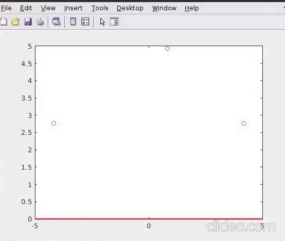

# matlab-spline-interpolation
A MATLAB implementation of spline interpolation
## Spline Interpolation
In the mathematical field of numerical analysis, [spline interpolation](https://en.wikipedia.org/wiki/Spline_interpolation) is a form of interpolation where the interpolant is a special type of piecewise polynomial called a spline.
### Output

